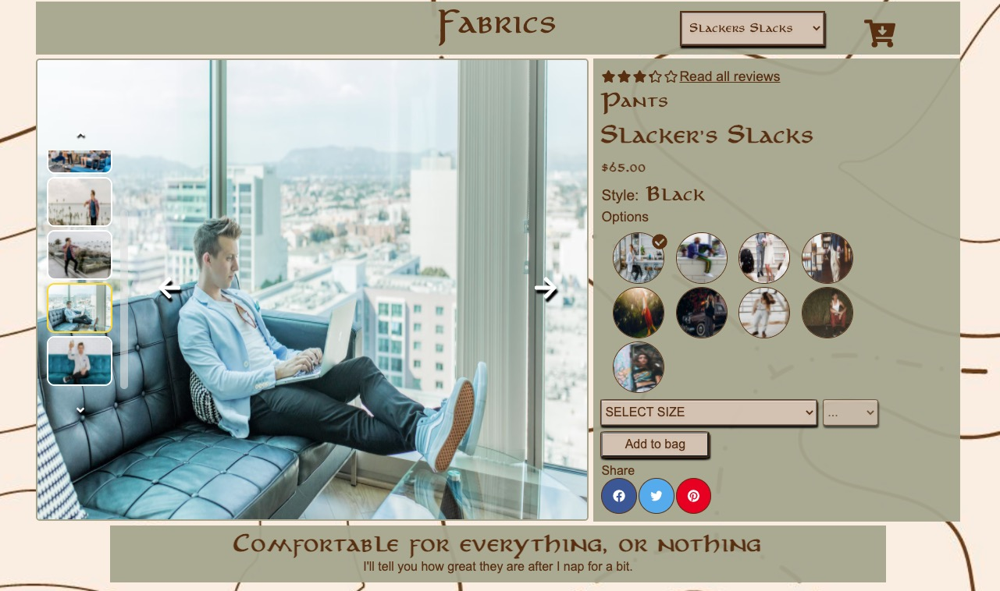
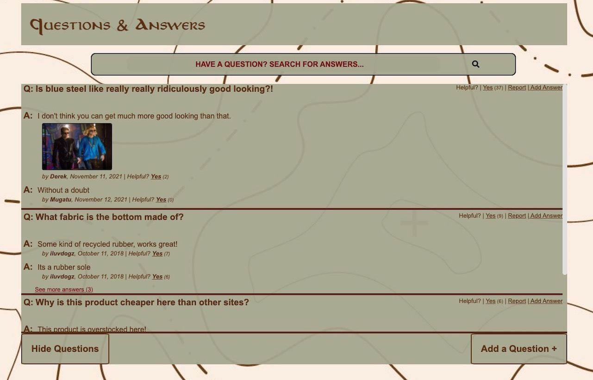
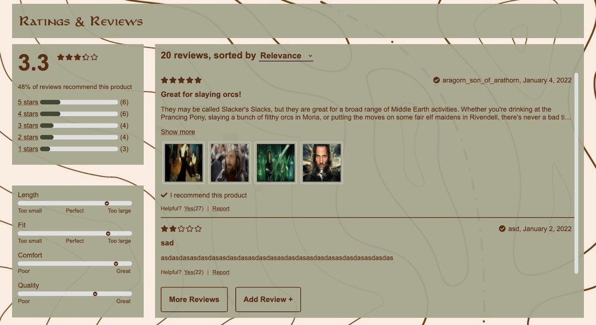

<h1 align="center">Fabrics</h1>

## Description
***Fabircs*** is a dynamic front end web application designed and built for a mock e-commerce clothing brand. The application offers users ability to view store products/styles, select items for purchase, view questions and answers, and see how others rated the selected product. The app was built by myself and two other engineers, primarily using ReactJS with an ExpressJS proxy server, and then deployed to AWS. I developed the Ratings & Reviews section of the application which includes a rating and characteristic breakdown, list of reviews, and the following features:
- Review list is sortable based on relevance, newest, and most helpful
- Rating breakdown doubles as an additive filter for the reveiw list
- Pop-up modal to rate the product and write a new review, with field validation
- Initially shows two reviews but will render more upon button click
- Mark a review as helpful or report the review, can only select once per review
- Expanded view when photo thumbnail is clicked

---
## Installation
**Make sure your system meets the requirements below before following installation**
1. Clone this repo to your local machine:
    - `git clone https://github.com/Mitch311G/Fabrics.git`
2. Navigate the repo's root directory:
    - `cd Fabrics`
3. Install project dependencies:
    - `npm install`
4. Create `.env` file in the root directory, then copy and paste contents from `.env.example` into your `.env`.
    - Your github `Personal access token` goes in your `.env` file as the `API_KEY`.
5. Run `npm run build-dev` to build `dist/bundle.js` and `npm run start-dev` to start development server at `localhost:3000`.
6. Start developing!

### Requirements
1. Install the following to your system (if not done already):
    - [Node.js and npm](https://nodejs.org/en/download/)
2. Create a new `Personal access token` on github.
---
## Usage
**NOTE:** The following demonstration is for the Ratings & Reviews section of the application only.
- See more reviews, sort the reviews list, mark a review as helpful:

- Filter the review list by ratings:

- Add a new review:

---
## Provided scripts
- `npm run build-dev`
    - Using webpack and babel, this will bundle and transpile the contents of `client/src` directory into bundled `.js` file for browser consumption, which are linked to `index.html`, then **watch for changes and re-bundle on file changes**.
- `npm run build`
    - Builds the bundle for production and **does not watch for file changes**.
- `npm run start-dev`
    - Starts the development server (default is localhost:3000), then **watches for changes and restarts the server with updated content on file change**.
- `npm run start`
    - Starts the app's server, but **does not watch for file changes**.
---
## Authors and acknowledgment
***Fabrics*** was developed by [Mitchell Gardner](https://github.com/Mitch311G), [Marc Lawson](https://github.com/mlawso33-code), and [Sterling Muller](https://github.com/sterlingmuller).
